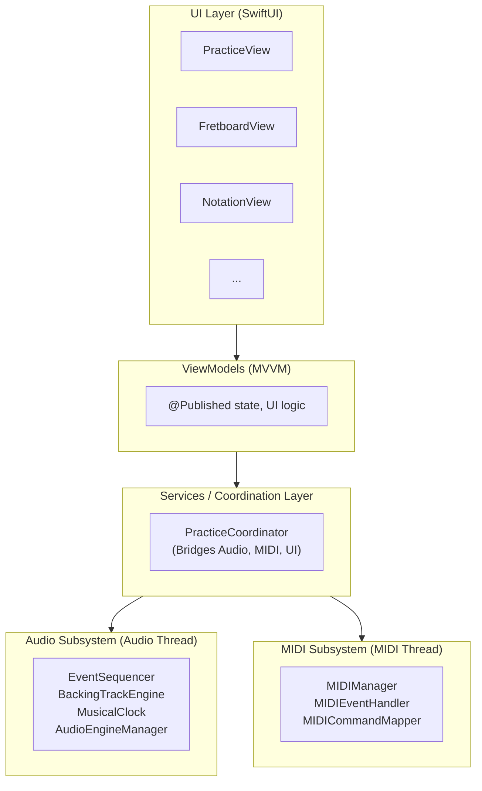
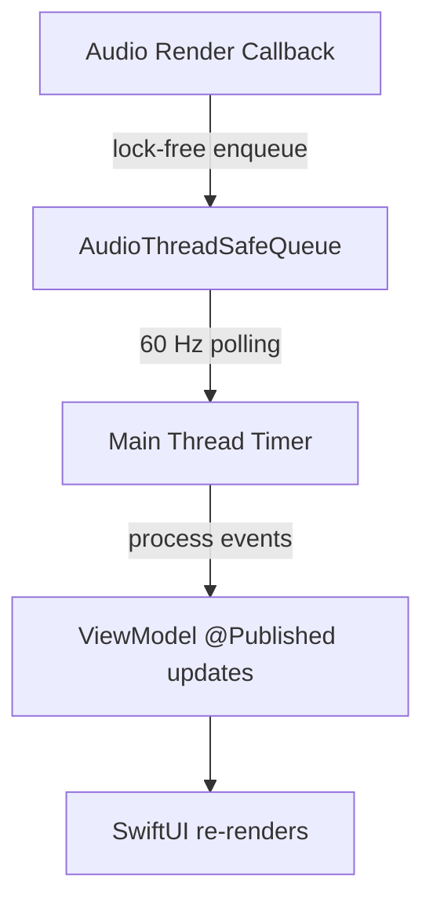
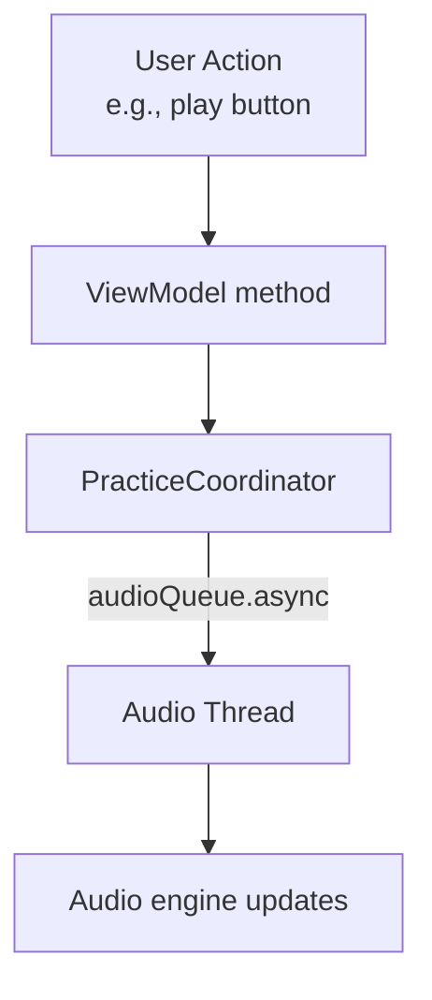
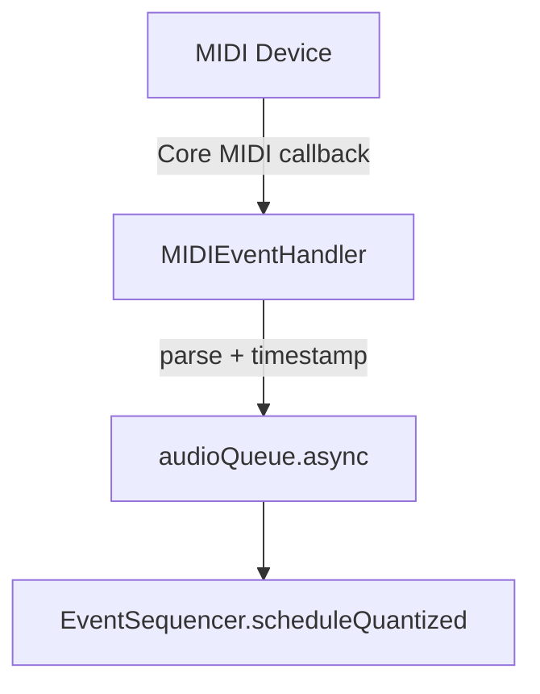
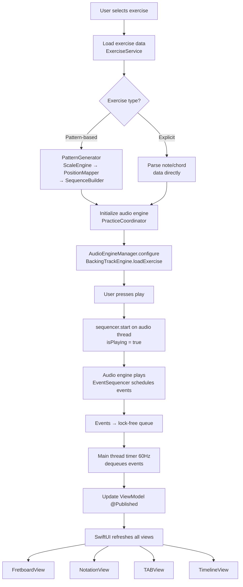
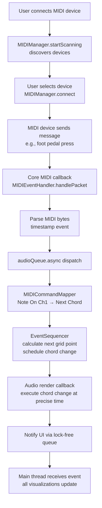

# Architecture Overview

## System Architecture

SergeantMusic is built using a layered architecture that separates concerns between real-time audio processing, MIDI handling, business logic, and user interface.

### High-Level Architecture



## Layer Responsibilities

### 1. UI Layer (SwiftUI)
**Technology:** SwiftUI + Canvas for custom rendering

**Responsibilities:**
- Display user interface
- Handle user interactions
- Render custom graphics (fretboard, notation, TAB)
- Bind to ViewModel @Published properties

**Key Components:**
- `PracticeView`: Main practice session interface
- `FretboardView`: Animated fretboard with Canvas
  - Displays played notes in real-time
  - Shows chord diagrams
  - Theory overlay with intervals/scale degrees
- `NotationView`: Sheet music with scrolling cursor
- `TABView`: Guitar tablature display
- `TimelineView`: Chord block timeline
- `ExerciseLibraryView`: Exercise selection

**Note:** View switchability is configured per exercise (some exercises may restrict certain views)

**Threading:** Main thread only

### 2. ViewModel Layer (MVVM Pattern)
**Technology:** SwiftUI ObservableObject, Combine

**Responsibilities:**
- Manage UI-specific state
- Transform service data for UI consumption
- Handle user input commands
- Publish state changes via @Published

**Key Components:**
- `PracticeViewModel`: Practice session UI state
- `FretboardViewModel`: Fretboard display state
- `NotationViewModel`: Notation display state
- `ExerciseLibraryViewModel`: Exercise list state

**Threading:** Main thread for @Published updates

### 3. Services / Coordination Layer
**Technology:** Swift classes with Combine publishers

**Responsibilities:**
- Orchestrate subsystems (Audio, MIDI, UI)
- Manage application-level state
- Bridge between audio thread and main thread
- Business logic and data transformation

**Key Components:**
- `PracticeCoordinator`: Central coordinator
  - Manages audio engine + MIDI + exercise lifecycle
  - Publishes playback state to ViewModels
  - Coordinates visualization updates
- `ExerciseService`: Exercise loading and parsing
- `PreferencesService`: User settings persistence

**Threading:** Operates across threads, uses thread-safe queues

### 4. Audio Subsystem
**Technology:** AVAudioEngine, AudioKit, Core Audio

**Responsibilities:**
- Real-time audio synthesis and playback
- Sample-accurate event scheduling
- Musical timing (beats, bars, tempo)
- Backing track generation

**Key Components:**
- `AudioEngineManager`: AVAudioEngine lifecycle
- `EventSequencer`: Event scheduling with quantization
- `MusicalClock`: Tempo and beat tracking
- `BackingTrackEngine`: Instrument coordination
- `SamplePlayer`: Drum sample playback
- `SynthesizerNode`: Bass/pad synthesis
- `QuantizationEngine`: Snap to grid logic

**Threading:** Audio render thread (real-time priority)
**Critical Constraint:** NO allocations, NO locks, NO Objective-C on audio thread

### 5. MIDI Subsystem
**Technology:** Core MIDI

**Responsibilities:**
- MIDI device discovery and connection
- MIDI message parsing
- Command mapping (pedal press → app action)
- Quantized command execution

**Key Components:**
- `MIDIManager`: Device lifecycle
- `MIDIDeviceScanner`: Device discovery
- `MIDIEventHandler`: Packet parsing
- `MIDICommandMapper`: MIDI → app commands

**Threading:** Core MIDI callback thread
**Constraint:** Must dispatch quickly to audio queue

### 6. Rendering Layer
**Technology:** SwiftUI Canvas + Core Graphics

**Responsibilities:**
- Custom graphics rendering (60 FPS target)
- Visualization of musical data
- Playback cursor and highlighting
- Performance optimization (caching, dirty regions)

**Key Components:**
- `PlaybackCursor`: Sample time → screen position
- `FretboardRenderer`: Fretboard Canvas drawing
- `NotationRenderer`: Sheet music Canvas drawing
- `TABRenderer`: Tablature Canvas drawing
- `TimelineRenderer`: Chord timeline Canvas drawing

**Threading:** Main thread (SwiftUI Canvas)

### 7. Pattern Generation Subsystem
**Technology:** Swift algorithms

**Responsibilities:**
- Algorithmic exercise generation from patterns
- Scale and chord generation in any key
- Fretboard position mapping with constraints
- Sequence building (inversions, directions, rhythms)

**Key Components:**
- `PatternGenerator`: Orchestrates pattern-to-notes conversion
- `ScaleEngine`: Generates scale notes for any key/scale type
- `PositionMapper`: Maps notes to fretboard with fingering rules
- `SequenceBuilder`: Creates note sequences (inversions, directions)
- `PatternDefinition.swift`: Pattern data model

**Threading:** Can run on background thread for complex patterns

**Note:** Most exercises are pattern-based, enabling random key practice and infinite variations from single pattern definitions.

### 8. Core Layer
**Technology:** Swift structs and classes

**Responsibilities:**
- Domain models (Note, Chord, Exercise, etc.)
- Shared utilities
- Musical concepts and calculations

**Key Components:**
- `MusicalConcepts.swift`: Note, Chord, Scale, Interval
- `Exercise.swift`: Exercise data model (supports both pattern and explicit types)
- `MIDIMapping.swift`: MIDI device configuration
- `TimeConversion.swift`: Musical time ↔ samples

**Threading:** Thread-safe value types

## Threading Model

### Three Primary Threads

#### 1. Audio Render Thread (Highest Priority)
- Real-time scheduling priority
- Runs AVAudioEngine render callbacks
- **MUST BE LOCK-FREE**: No allocations, no locks, no Objective-C
- Processes audio buffers (typically 256-512 samples)
- Schedules events, updates musical clock
- Communicates via lock-free queue → main thread

#### 2. Main Thread (UI Thread)
- Handles all SwiftUI updates
- Receives events from audio thread via queue
- Updates @Published properties in ViewModels
- Sends commands to audio thread via audio queue
- 60 Hz timer polls audio event queue

#### 3. MIDI Callback Thread
- Receives MIDI packets from Core MIDI
- Immediately timestamps and dispatches to audio queue
- Minimal processing (parsing only)

### Thread Communication Patterns

#### Audio → Main Thread (State Updates)



**Implementation:** Lock-free ring buffer with atomic operations

#### Main Thread → Audio Thread (Commands)



**Implementation:** Serial DispatchQueue with QoS .userInteractive

#### MIDI Thread → Audio Thread (Events)



**Implementation:** Immediate dispatch to audio queue

## Data Flow

### Practice Session Flow



### MIDI Control Flow



## Key Design Decisions

### 1. MVVM Over TCA (Phase 1)
**Rationale:**
- Lower learning curve for new iOS developer
- Audio threading is architecture-agnostic
- Faster initial velocity
- Clear migration path to TCA exists

**Trade-offs:**
- Less predictable state flow than TCA
- Requires discipline for testability
- Potential for state bugs without strict patterns

### 2. Lock-Free Audio Communication
**Rationale:**
- Audio thread cannot use locks (real-time constraints)
- Industry standard pattern for audio apps
- Guaranteed latency bounds

**Trade-offs:**
- More complex than @Published
- Requires careful implementation
- Needs thorough testing with Thread Sanitizer

### 3. 60 Hz UI Update Polling
**Rationale:**
- Batches audio events for efficiency
- Matches screen refresh rate
- Avoids overwhelming SwiftUI with updates

**Trade-offs:**
- Max 16ms latency for UI updates (acceptable)
- Timer must be reliable
- Events queue between polls

### 4. Canvas + Core Graphics (Not Metal)
**Rationale:**
- Sufficient for 2D rendering at 60 FPS
- Easier for new developer
- Integrates cleanly with SwiftUI

**Trade-offs:**
- May need Metal for 3D features later
- CPU rendering (not GPU accelerated)
- Must optimize drawing carefully

### 5. Separate Audio and MIDI Threads
**Rationale:**
- Core MIDI runs on its own thread
- Can't control MIDI thread timing
- Must bridge to audio thread quickly

**Trade-offs:**
- Additional thread coordination
- MIDI latency includes dispatch time
- Must timestamp immediately

## Module Organization

```
SergeantMusic/
├── App/
│   ├── SergeantMusicApp.swift
│   └── AppCoordinator.swift
├── Core/
│   ├── Models/
│   ├── PatternGeneration/
│   │   ├── PatternGenerator.swift
│   │   ├── ScaleEngine.swift
│   │   ├── PositionMapper.swift
│   │   └── SequenceBuilder.swift
│   ├── Extensions/
│   └── Utilities/
├── Audio/
│   ├── AudioEngine/
│   ├── Sequencer/
│   ├── Synthesis/
│   └── Threading/
├── MIDI/
├── Features/ (MVVM modules)
│   ├── Practice/
│   ├── Fretboard/
│   ├── Notation/
│   ├── Timeline/
│   ├── ExerciseLibrary/
│   └── Settings/
├── Services/
├── Rendering/
└── Resources/
    ├── Exercises/ (JSON)
    │   ├── patterns/
    │   │   ├── scales/
    │   │   ├── arpeggios/
    │   │   └── intervals/
    │   └── explicit/
    │       ├── songs/
    │       └── chord-progressions/
    ├── Samples/ (audio)
    └── Assets.xcassets
```

## Performance Targets

- **Audio Latency:** < 20ms (256-sample buffer at 44.1kHz)
- **MIDI Jitter:** < 5ms (timestamp immediately, quantize precisely)
- **UI Frame Rate:** 60 FPS sustained during playback
- **Audio-Visual Sync:** < 50ms perceived latency
- **Memory:** Pre-allocate all audio buffers, no runtime allocations
- **CPU:** < 50% during playback (leave headroom)

## Testing Strategy

- **Unit Tests:** Pure functions, model parsing, time conversions
- **Integration Tests:** Audio engine lifecycle, MIDI connection, sequencer timing
- **Thread Sanitizer:** Detect data races in lock-free code
- **Manual Testing:** Latency measurement on real hardware, multiple devices

## Next Steps

1. Implement Audio subsystem (AudioEngineManager, EventSequencer)
2. Implement lock-free queue (AudioThreadSafeQueue)
3. Implement Pattern Generation subsystem (PatternGenerator, ScaleEngine, PositionMapper)
4. Implement PracticeCoordinator (bridge layer)
5. Build basic UI with PracticeView
6. Add MIDI support incrementally
7. Iterate on visualization system

---

**Related Documents:**
- [MVVM vs TCA Comparison](mvvm-vs-tca-comparison.md)
- [Audio Architecture](audio-architecture.md)
- [MIDI Architecture](midi-architecture.md)
- [Visualization Architecture](visualization-architecture.md)
- [State Management](state-management.md)
- [Exercise JSON Schema](../exercise-json-schema.md)
- [ADR-011: Algorithmic Pattern Generator](../adr/ADR-011-algorithmic-pattern-generator.md)
